# Welcome {background-image="assets/welcome_symbol.png" background-opacity="0.3" background-size="cover" background-color="#2d4059"}


## Who are we?

:::: {.columns}

::: {.column width="50%"}
{height="250px"}

**Dr. Phillip Keldenich**

- Over a decade of experience in algorithm engineering research.
- Heinrich-Büssing-Preis winner
- Academic, deep view.
- His son knows more about excavators than you ever will.
:::

::: {.column width="50%"}
{height="250px"}

**Dr. Dominik Krupke**

- Over a decade of experience in algorithm engineering research.
- Over two years of experience in consulting.
- Author of *[The CP-SAT Primer](https://d-krupke.github.io/cpsat-primer/)*.
- Applied, broad view.
:::

::::


# Why Algorithm Engineering? {background-image="assets/why_ae_symbol.png" background-opacity="0.3" background-size="cover" background-color="#2d4059"}


:::: {.notes}
Now let us make this concrete.

Rather than defining the field abstractly, I want to start with examples. The easiest way to understand Algorithm Engineering is to look at the kinds of decisions that organizations need algorithms for, and that become computationally hard surprisingly quickly.

We will go through a few domains. The point is not that you need to know these applications already. The point is that very different industries run into the same underlying algorithmic challenges.
::::

## Shift Scheduling and Task Assignments {background-image="assets/symbol_shift_planning.png" background-size="cover" background-opacity="0.3" .center-title}

:::: {.notes}
Shift scheduling — chances are you know someone who's complained about theirs. A nurse who always gets the night shift, a friend in retail who never gets weekends off. Someone has to assign shifts to people while respecting work regulations, qualifications, preferences, fairness. It's surprisingly complex, and it's still done by hand in a lot of places. In academia this is called the nurse rostering problem, but it shows up everywhere — retail, call centers, manufacturing, emergency services.
::::

## Logistics {background-image="assets/symbol_logistics.png" background-size="cover" background-opacity="0.3" .center-title}

:::: {.notes}
From scheduling people, let's move to scheduling things. Logistics is a massive area for optimization. Amazon is pouring serious money into improving its routing algorithms — because a single percent of savings on routes translates to millions at scale. But it's not just the big players. Even your plumber around the corner has to solve a routing problem every morning — which jobs to do in which order, how to minimize driving between appointments. The scale is different, but the problem is the same.
::::

## Energy Networks {background-image="assets/symbol_power_grid.png" background-size="cover" background-opacity="0.3" .center-title}

:::: {.notes}
Moving from roads to power lines. The energy sector is one of the most optimization-intensive industries. Think about what a grid operator has to do: balance supply and demand in real time, with wind and solar that you can't control. Every hour, someone has to decide which power plants to turn on and off — that's called unit commitment, and it's a large optimization problem solved every single day. On top of that, there's electricity market bidding, grid expansion planning, storage scheduling. The energy transition is making all of these harder and more important.
::::

## Production Planning {background-image="assets/assembly_line_realistic.png" background-size="cover" background-opacity="0.3" .center-title}

:::: {.notes}
Production planning is another huge area — and not just in automotive. Anywhere you have a factory, a workshop, or a production line, someone has to decide what to produce, in what order, and how to use the available capacity. Pharma, food, semiconductors, steel — it's everywhere. Let me show you one specific problem from car manufacturing to give you a feel for what this looks like up close.
::::

## Car Sequencing {background-image="assets/assembly_line_symbol.png" background-size="cover" background-opacity="0.2"}

Cars move on a conveyor past all stations at a fixed pace.  
The line does not stop — each station must finish before the next car arrives.

::: {.fragment}
`A → A → B → ...`

Option **Sunroof**: high workload  → Too many in a row and workers fall behind
:::

::: {.fragment}
`A → B → A → B → A → ...`

Better for sunroof —  but now **Tow bar** is overloaded (e.g., ≤ 1 in 3)
:::

::: {.fragment}
Each option imposes a pattern constraint:

- “At most 2 in 5”
- “At most 1 in 3”
- “At most 3 in 7”

Find the most efficient sequence that satisfies all of them.
:::


## Same algorithm, different uses

The same optimization algorithm can be used in different ways:

::: {.incremental}
- **Operational use** — compute concrete plans and update them as reality changes
- **Feasibility & understanding** — check what is possible under given constraints
- **Exploration** — test changes to the system and compare outcomes
:::

::::{.notes}
Now here's something that's easy to miss. When people think about an optimization algorithm, they usually think of one thing: you give it data, it gives you a plan.

[CLICK]
And that’s one use. You run it operationally — you compute a concrete production sequence, and you update it when reality changes.

[CLICK]
But that’s not the only role. You can also use the same algorithm much earlier, just to understand the system. For example: can we even produce this mix of cars with our current setup? You’re not building a schedule — you’re probing feasibility.

[CLICK]
Or you use it exploratively. You change the system itself — for example, a faster station — and ask: what would happen? Would it help, or is something else the bottleneck?

It’s the same algorithm in all cases. What changes is how you use it — not just to produce plans, but to understand and experiment.

And this carries over across domains: logistics, energy, scheduling. The algorithm is not just producing solutions — it becomes a tool for reasoning about the system.
::::

# What is Algorithm Engineering? {background-image="assets/symbol_math_to_machine.png" background-opacity="0.3" background-size="cover" background-color="#2d4059"}

Nearly all of these problems are **NP-hard**. Yet industry solves them every day.

::: {.fragment}
This course teaches you **how** — and **why it works**.
:::


## What to expect

:::: {.columns}
::: {.column width="30%"}
::: {.fragment fragment-index=1}
**The Machine**

- CPU architecture & caches
- Data structures & algorithms
- Performance engineering
:::
:::

::: {.column width="5%"}
:::

::: {.column width="30%"}
::: {.fragment fragment-index=2}
**The Toolkit**

- MIP, SAT, CP (general-purpose solvers)
- Graph algorithms
- Decomposition & metaheuristics
:::
:::

::: {.column width="5%"}
:::

::: {.column width="30%"}
::: {.fragment fragment-index=3}
**The Real World**

- Robustness & uncertainty
- Benchmarking methodology
- Testing & software engineering
:::
:::
::::

::: {.fragment fragment-index=4}
**Prerequisites:** Coding, complexity theory, fundamental algorithms & data structures.
:::


# Performance Engineering {background-image="assets/symbol_speed.png" background-opacity="0.3" background-size="cover" background-color="#2d4059"}

Your algorithms course taught you Big-O. That's not enough.


## How fast can you multiply two matrices?

:::: {.columns}

::: {.column width="45%"}
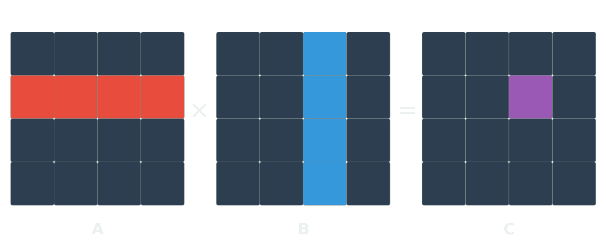{height="280px"}
:::

::: {.column width="55%"}
Two 4096 × 4096 matrices. Simple code:

```python
for i in range(4096):
    for j in range(4096):
        for k in range(4096):
            C[i][j] += A[i][k] * B[k][j]
```
:::


::::

::: {.fragment}
This takes **7 hours**. How much room for optimization is there?
:::

::: {.fragment}
[**60,000×. Down to 0.41 seconds. Same machine. Same result.**]{style="color: #e74c3c; font-size: 1.3em"}
:::


## How do we get there?

| Version | Implementation | Time (s) | Speedup |
|:-------:|----------------|----------:|--------:|
| 1 | Python | 25,553 | 1× |
| 2 | Java | 2,373 | 11× |
| 3 | C | 543 | 47× |
| 4 | + parallel loops | 70 | 366× |
| 5 | + divide & conquer | 3.8 | 6,727× |
| 6 | + vectorization | 1.1 | 23,224× |
| 7 | + AVX intrinsics | 0.41 | **62,806×** |

::: {.source-note style="text-align: center"}
Source: @leiserson2020, Table 1. Two 4096×4096 matrices, 64-bit floats.
:::

::: {.fragment}
::: {.highlight-box}
$O(n^3)$ is polynomial. The algorithm is "fine."

[**But there's a 60,000× gap between fine and fast.**]{style="color: #e74c3c"}
:::
:::


# NP-Hard ≠ Unsolvable {background-image="assets/symbol_nphard.png" background-opacity="0.3" background-size="cover" background-color="#2d4059"}

Your complexity course told you to give up. Let's reconsider.


## The Knapsack Problem

:::: {.columns}

::: {.column width="45%"}
You have a set of items, each with a **weight** and a **value**. Your bag has a **weight limit**.

**Goal:** Pick items to maximize total value without exceeding the limit.

::: {.fragment}
| Item | Weight | Value |
|------|--------|-------|
| Laptop | 3 kg | 10 |
| Book | 1 kg | 3 |
| Jacket | 2 kg | 5 |
| Camera | 2 kg | 7 |
| Snacks | 1 kg | 2 |

Capacity: **5 kg**. What do you pick?
:::
:::

::: {.column width="10%"}
:::

::: {.column width="45%"}
::: {.fragment}
Best: Laptop + Camera = **17** (5 kg) ✓

::: {.highlight-box}
This is the **Knapsack Problem** — and it's NP-hard.
:::

*But you can't just decide not to solve it. Every time you pack a truck, allocate a budget, or select features for a release — you're solving a knapsack problem.*
:::
:::

::::


## Brute force is not an option

Try all $2^n$ subsets, keep the best feasible one.

:::: {.columns}
::: {.column width="50%"}
::: {.fragment}
**50 items:** $2^{50} \approx 10^{15}$ subsets

At $10^9$/second → **13 days**
:::
:::

::: {.column width="50%"}
::: {.fragment}
**100 items:** $2^{100} \approx 10^{30}$ subsets

At $10^{18}$/second → **31,000 years**
:::
:::
::::

::: {.fragment}
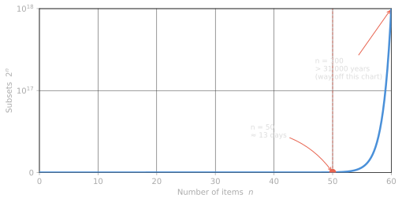{width="70%" fig-align="center"}
:::


## NP-hard ≠ unsolvable

::: {.fragment fragment-index=1}
Real-world problems have **structure** — most of the search space is junk.
:::

::: {.fragment fragment-index=2}
Smart algorithms exploit this: **prune** infeasible branches, **bound** what's achievable, **propagate** constraints.
:::

::: {.r-stack}
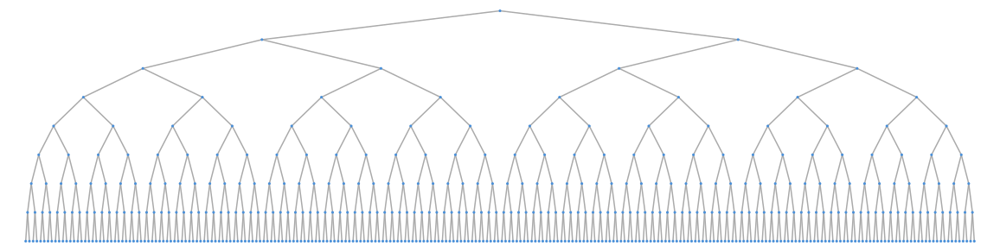{.fragment fragment-index=1 width="110%"}

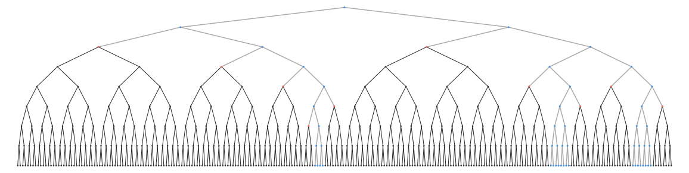{.fragment fragment-index=3 width="110%"}

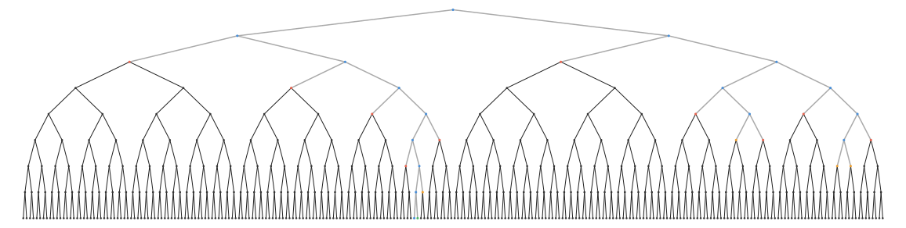{.fragment fragment-index=4 width="110%"}

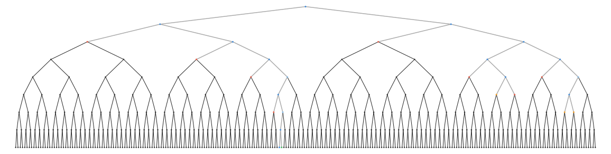{.fragment fragment-index=5 width="110%"}
:::

::: {.fragment fragment-index=5}
::: {.highlight-box}
Result: **well-structured** problems with **millions of variables** solved routinely — despite exponential worst case.
:::
:::


## Standing on the shoulders of giants

::: {.fragment}
Decades of research on branch & bound, constraint propagation, and LP
relaxation are packaged into **battle-tested generic solvers**.
:::

::: {.fragment}
You don't need to reimplement any of it — just like a database engineer
never reimplements PostgreSQL.
:::

::: {.fragment}
::: {.highlight-box}
**Declarative modelling languages** let you describe *what* you want.
The solver figures out *how* to search.
:::
:::

::: {.fragment}
<div style="display:flex; justify-content:space-around; align-items:center; margin-top:1.2em; gap:1.5em; opacity:0.8;">
<div style="text-align:center;">
<div style="font-size:0.5em; margin-top:0.4em; color:#aaa;">Gurobi</div>
</div>
<div style="text-align:center;">
<div style="font-size:0.5em; margin-top:0.4em; color:#aaa;">OR-Tools</div>
</div>
<div style="text-align:center;">
<div style="font-size:0.5em; margin-top:0.4em; color:#aaa;">Hexaly</div>
</div>
<div style="text-align:center;">
<div style="font-size:0.5em; margin-top:0.4em; color:#aaa;">Xpress</div>
</div>
<div style="text-align:center;">
<div style="font-size:0.5em; margin-top:0.4em; color:#aaa;">GAMS</div>
</div>
<div style="text-align:center;">
<div style="font-size:0.5em; margin-top:0.4em; color:#aaa;">MiniZinc</div>
</div>
</div>
:::


## Think about what a database engineer does

::: {.incremental}
1. **Choose the right system** — relational, document, key-value, ...
2. **Design the structure** — schema, entities, constraints, indexes
3. **Trust the engine** — understand internals, but only go custom when the benefit justifies the cost
:::

::: {.fragment}
::: {.highlight-box}
**Optimization works similarly.** Choose the right solver, design the model well, let the engine do the search.
:::
:::


## Declarative Modeling: the Knapsack

:::: {.columns}

::: {.column width="47%"}
A **model** describes your problem in three parts:

1. **Decision variables** — the choices
2. **Constraints** — the rules
3. **Objective** — what to optimize

::: {.highlight-box}
You describe *what* — the solver figures out *how*.
:::
:::

::: {.column width="6%"}
:::

::: {.column width="47%"}
::: {.fragment fragment-index=1}
**Variables:** $x_i \in \{0, 1\}$ for each item $i$
:::

::: {.fragment fragment-index=2}
**Constraint:**
$$\sum_{i} x_i \cdot w_i \leq C$$
:::

::: {.fragment fragment-index=3}
**Objective:**
$$\text{Max} \quad \sum_{i} x_i \cdot v_i$$
:::
:::

::::


## The full code

```{.python code-line-numbers="1|3-6|8-10|12-14|16-18|20-22"}
from ortools.sat.python import cp_model  # pip install -U ortools

# Parameters: 100 items with weights and importance scores
weights = [395, 658, 113, 185, 336, ...]  # grams
values = [71, 15, 100, 37, 77, ...]       # importance 0-100
capacity = 8000                            # 8 kg carry-on limit

# Model
model = cp_model.CpModel()
xs = [model.new_bool_var(f"x_{i}") for i in range(len(weights))]

# Constraint: total weight <= capacity
model.add(sum(x * w for x, w in zip(xs, weights)) <= capacity)

# Objective: maximize total value
model.maximize(sum(x * v for x, v in zip(xs, values)))

# Solve
solver = cp_model.CpSolver()
status = solver.solve(model)
print("Packed value:", solver.objective_value)
# >>> status: OPTIMAL | objective: 2394 | walltime: 0.01s
```

::: {.fragment}
::: {.highlight-box}
Optimal solution out of $2^{100}$ possibilities — found in **0.01 seconds**.
:::
:::


## Change request!

Users want **at most one item per type** (e.g., choose heavy *or* light hiking boots).

::: {.fragment}
```python
item_types = [[0, 1], [2, 3, 4], [5, 6]]  # boots, jackets, swim gear

for item_type in item_types:
    model.add_at_most_one(xs[i] for i in item_type)
```
:::

::: {.fragment}
::: {.highlight-box}
That's it. **Three lines.** No refactor of search logic needed.
:::
:::


# Beyond Simple Models {background-image="assets/symbol_scale.png" background-opacity="0.3" background-size="cover" background-color="#2d4059"}


## The Traveling Salesman Problem

The knapsack is actually quite tame. **TSP is not** — you don't get it right by accident.

:::: {.columns}

::: {.column width="55%"}
::: {.incremental}
- Easy to state: visit every city exactly once, minimize total distance
- One of the great reference problems in optimization
- Many techniques were first developed for TSP and then generalized
:::

::: {.fragment}
State-of-the-art solvers can handle instances with **tens of thousands of cities** — provably optimal. Heuristics can tackle **millions**.
:::

:::

::: {.column width="45%"}
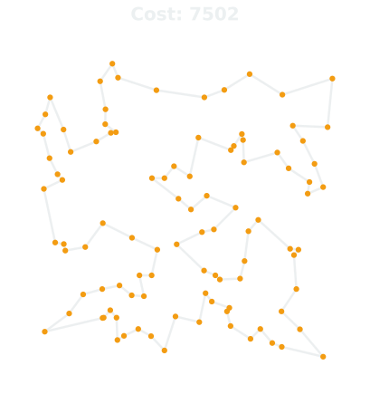{height="500px"}
:::

::::


## The magic ingredient: LP relaxation

:::: {.columns}

::: {.column width="50%" style="text-align: center;"}
{height="80%"}

**NP-hard**
:::

::: {.column width="50%" style="text-align: center;"}
::: {.fragment}
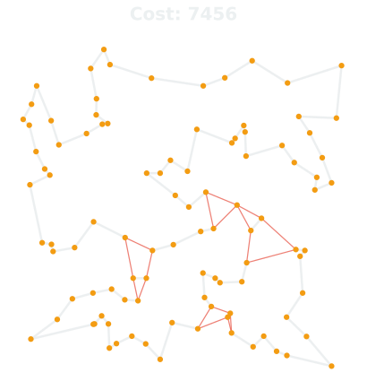{height="80%"}

**Polynomial**
:::
:::

::::


## This works for any linear model

:::: {.columns}

::: {.column width="45%"}
**MIP** (NP-hard)

$$
\begin{align}
\text{Max} \quad & \sum_{i} x_i \cdot v_i \\
\text{s.t.} \quad & \sum_{i} x_i \cdot w_i \leq C \\
& x_i \in \{0, 1\}
\end{align}
$$
:::

::: {.column width="45%"}
::: {.fragment fragment-index=1}
**LP** (polynomial)

$$
\begin{align}
\text{Max} \quad & \sum_{i} x_i \cdot v_i \\
\text{s.t.} \quad & \sum_{i} x_i \cdot w_i \leq C \\
& 0 \leq x_i \leq 1
\end{align}
$$
:::
:::

::::

::: {.fragment fragment-index=2}
Any problem with **linear constraints** and **integer variables** can be relaxed this way.
:::


## Branch & Bound — visualized

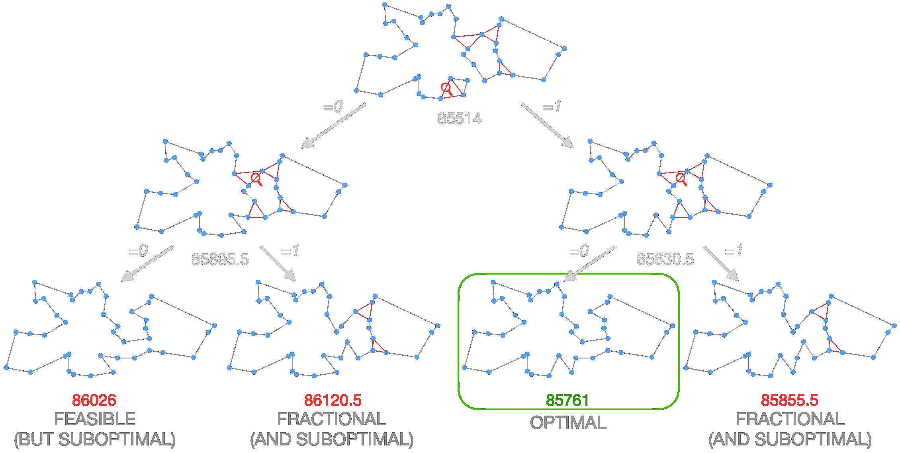

::: {.fragment}
::: {.highlight-box}
relax → bound → branch → prune
:::
:::


## SAT: Logic problems, surprisingly fast

:::: {.columns}
::: {.column width="60%"}
Not all problems are equations — some are **logical implications**.

::: {.fragment fragment-index=1}
$$(\neg x_1 \lor x_2) \;\land\; (x_1 \lor x_3 \lor \neg x_4) \;\land\; (\neg x_2 \lor \neg x_3)$$

Find True/False for $x_1, \ldots, x_n$ that satisfies **all** clauses — or prove none exists.
:::
:::

::: {.column width="5%"}
:::

::: {.column width="35%"}
::: {.fragment fragment-index=2}
**Encodable as SAT:**

- Nurse scheduling
- Hardware verification
- Dependency resolution
- Configuration & planning
:::
:::
::::

::: {.fragment fragment-index=3}
::: {.highlight-box}
Worst-case $O(2^n)$, but in practice: **millions of variables** solved routinely.
:::
:::


## CP-SAT: The full declarative framework

**Integer & interval variables**, rich constraints (`all different`, `no overlap`, `cumulative`), and optimization — one solver.

:::: {.columns}
::: {.column width="55%"}
::: {.fragment fragment-index=1}
**Example: 2D bin packing**

```python
height = model.new_int_var(0, H_max, "height")
for w, h in boxes:
    x = model.new_int_var(0, W - w, f"x_{i}")
    y = model.new_int_var(0, H_max - h, f"y_{i}")
    x_ivls += [model.new_fixed_size_interval_var(x, w)]
    y_ivls += [model.new_fixed_size_interval_var(y, h)]
    model.add(y + h <= height)

model.add_no_overlap_2d(x_ivls, y_ivls)
model.minimize(height)
```
:::
:::

::: {.column width="45%"}
::: {.fragment fragment-index=2}
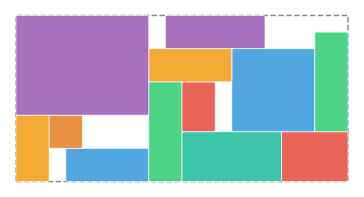{width="100%"}
:::
:::
::::

::: {.fragment fragment-index=3}
::: {.highlight-box}
CP-SAT combines ideas from **SAT, MIP, and Constraint Programming** into one solver.
:::
:::


# Tackling Larger Instances {background-image="assets/symbol_scaling_up.png" background-opacity="0.3" background-size="cover" background-color="#2d4059"}

What do you do when one model isn't enough?


## Decomposition

Some problems mix different structures that no single solver handles well. **Split them.**

:::: {.columns}
::: {.column width="55%"}
::: {.fragment fragment-index=1}
::: {.highlight-box}
**Example:** Delivery with 3D packing constraints.

- **Master:** Route planning → MIP
- **Subproblem:** Do packages fit? → CP
- Feedback loop if packing fails
:::
:::

::: {.fragment fragment-index=2}
Use the **right tool for each piece** — easier to solve separately than together.
:::
:::

::: {.column width="45%"}
::: {.fragment fragment-index=1}
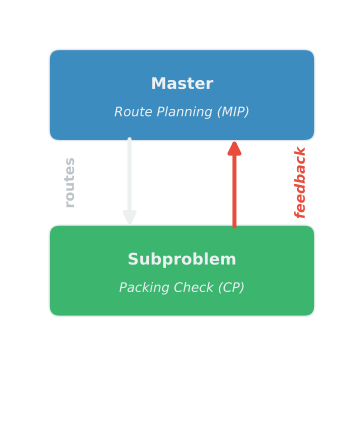{width="100%"}
:::
:::
::::


## Metaheuristics

:::: {.columns}
::: {.column width="45%"}
Your model is an abstraction — **good enough is good enough.**

::: {.fragment fragment-index=1}
Some of the most effective metaheuristics use **exact solvers** as building blocks.
:::

::: {.fragment fragment-index=2}
::: {.highlight-box}
**Large Neighborhood Search:**

1. Pick a region of the solution
2. **Destroy** it (remove 20% of stops)
3. **Repair** it optimally (MIP, CP, ...)
4. Repeat
:::
:::
:::

::: {.column width="55%"}
::: {.fragment fragment-index=2}
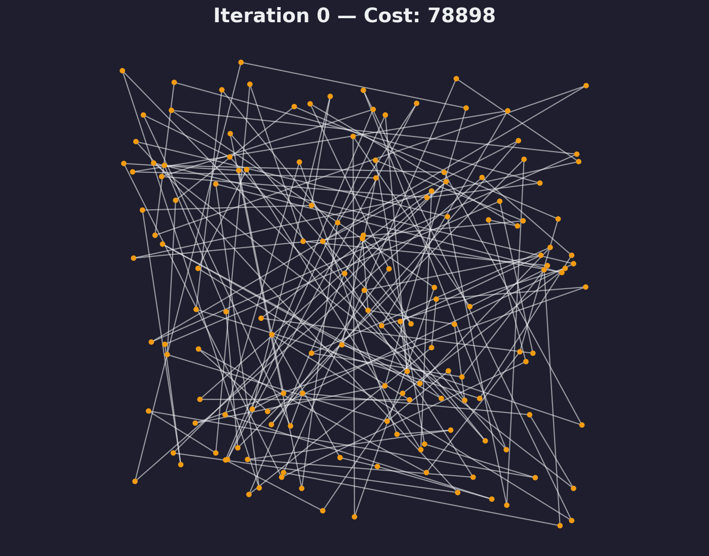{width="100%"}
:::
:::
::::


# The Real World {background-image="assets/symbol_real_world.png" background-opacity="0.3" background-size="cover" background-color="#1e1e2e"}

So we have all these powerful tools. Model your problem, hit solve, go home. Right?

::: {.fragment}
...Not quite.
:::


## Your perfect solution meets reality

:::: {.columns}
::: {.column width="55%"}
You optimized the delivery route. Minimal cost, minimal time. Beautiful.

::: {.fragment fragment-index=1}
One traffic jam and the whole plan falls apart.
:::

::: {.fragment fragment-index=2}
::: {.highlight-box}
If your solution is **brittle** and you can't recover quickly, it's not a production system.
:::
:::
:::

::: {.column width="45%"}
{width="100%"}
:::
::::


## Benchmarking is harder than you think

Which solver is best for this nurse scheduling problem?

:::: {.columns}

::: {.column width="50%"}
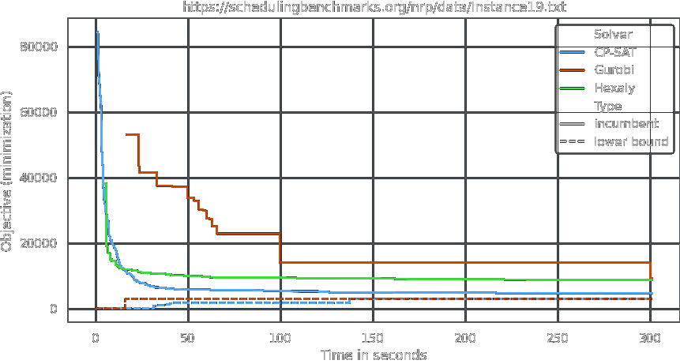
:::

::: {.column width="50%"}
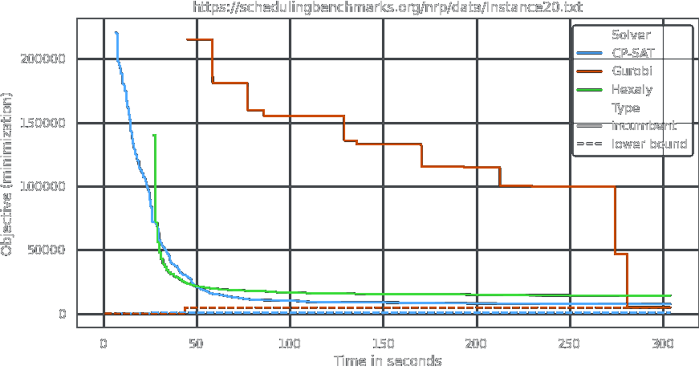
:::

::::

::: {.fragment}
::: {.highlight-box}
**It depends on when you stop the clock — and which instance you look at.** There is no single "fastest" solver.
:::
:::


## Your optimization code has special needs

:::: {.columns}
::: {.column width="60%"}
::: {.fragment fragment-index=1}
- A wrong constraint doesn't crash — the solver **quietly returns a worse solution**, and you never notice
- Requirements change constantly — without clean structure, you **rewrite from scratch**
:::

::: {.fragment fragment-index=2}
::: {.highlight-box}
We'll teach patterns to write optimization code that is **readable, testable, and maintainable**.
:::
:::
:::

::: {.column width="40%"}
{width="100%"}
:::
::::


# The Bigger Picture {background-image="assets/symbol_bigger_picture.png" background-opacity="0.3" background-size="cover" background-color="#2d4059"}


## It's not just about the algorithm

Planning a delivery route is not "just solving TSP."

::: {.incremental}
- Data collection, demand forecasting, driver constraints, customer preferences, fleet management
- The algorithm is **one piece** of a complex decision process
- Decisions unfold **over time** — new information arrives, plans must adapt
:::

::: {.fragment}
::: {.highlight-box}
You need to become a **problem solver**, not just an algorithm engineer.
:::
:::


## The INFORMS Analytics Framework

:::: {.columns}
::: {.column width="45%"}
](assets/IAF_Loop_Web_Graphic_large.png){width="100%"}
:::
::: {.column width="55%"}
::: {.fragment}
::: {.highlight-box}
The algorithm lives in **Domain V** — but it only works if the other six domains are right too.
:::
:::
:::
::::


## GenAI is changing the economics {background-image="assets/genai_symbol.png" background-size="cover" background-opacity="0.15"}

::: {.fragment}
Many problems are "not worth optimizing" — not because the math is too hard, but because **the expert is too expensive**.
:::

::: {.incremental}
- GenAI makes the expert faster — **not by replacing the solver**, but by accelerating modeling and iteration
- The data infrastructure built for AI also feeds optimization
  - more digital processes → more problems you *can* optimize
:::

::: {.fragment}
::: {.highlight-box}
Lower cost + better data → more problems become viable → **more demand, not less.**
:::
:::


## What you'll be able to do

By the end of this course, you will be a **problem solver** —

::: {.fragment}
with a toolkit to **efficiently and effectively tackle optimization challenges**,

even when they are NP-hard and others give up.
:::


## Recommended reading

:::: {.columns}
::: {.column width="20%"}
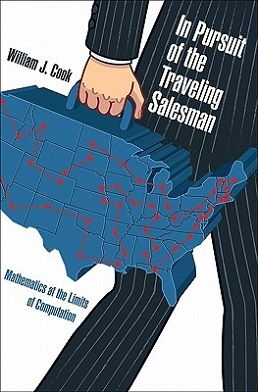{width="100%"}
:::
::: {.column width="20%"}
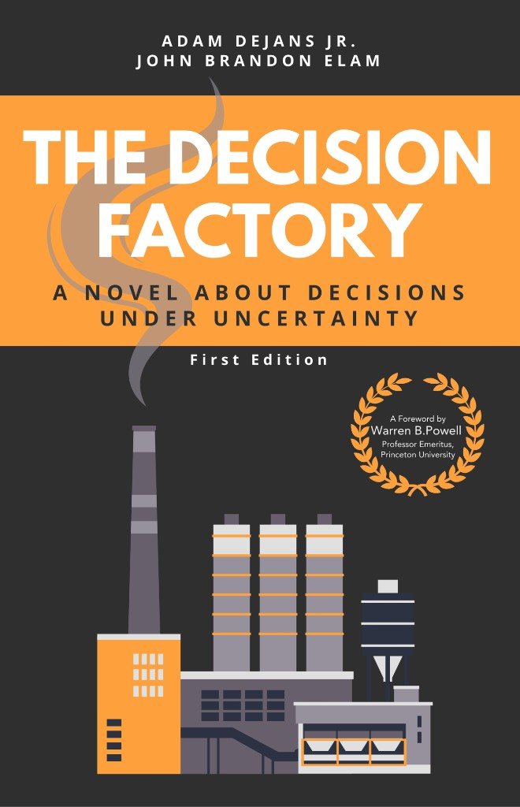{width="100%"}
:::
::: {.column width="20%"}
{width="100%"}
:::
::: {.column width="20%"}
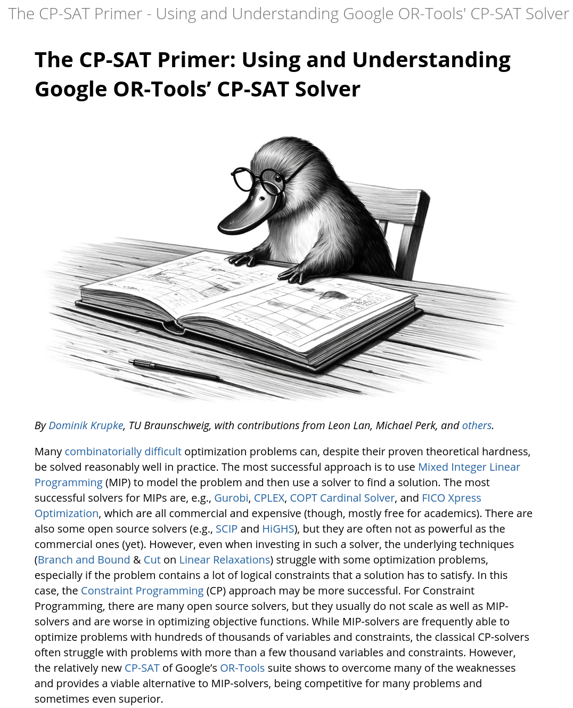{width="100%"}
:::
::::

:::: {.columns}
::: {.column width="20%"}
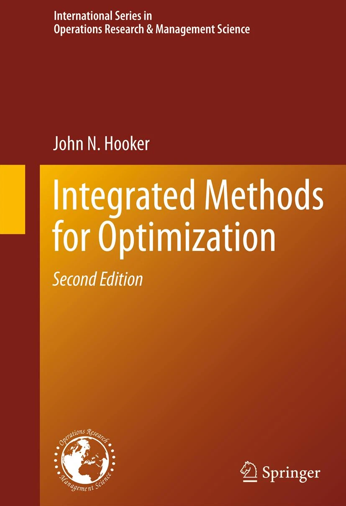{width="100%"}
:::
::: {.column width="20%"}
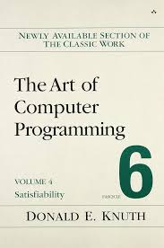{width="100%"}
:::
::: {.column width="20%"}
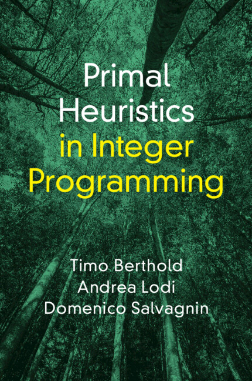{width="100%"}
:::
::::


## References

::: {#refs}
:::
